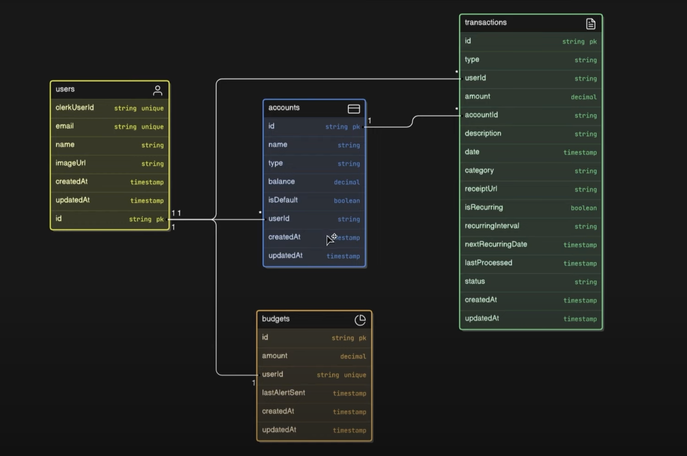

# AI Finance Platform

A full‑stack personal finance app built with Next.js App Router, Prisma (PostgreSQL), Clerk auth, Tailwind, shadcn/ui, Inngest for background jobs, Arcjet for protection/rate‑limiting, Google Gemini for receipt scanning, and Resend for transactional email.


### Database schema



## Features
- **Authentication**: Clerk-powered sign in/up and protected routes (`/dashboard`, `/account`, `/transaction`).
- **Accounts**: Create accounts with type, initial balance, and default account logic.
- **Transactions**:
  - Income/Expense with categories, dates, descriptions, status.
  - Recurring transactions with interval and next run calculation.
  - Automatic account balance updates on create/update/delete.
  - Bulk delete with account balance reconciliation.
- **Dashboard**: Account cards, progress, and recent transactions overview.
- **Receipt scanning (AI)**: Upload an image; Gemini 1.5 Flash extracts amount, date, merchant, category.
- **Emails**: Resend integration for sending emails from server actions.
- **Background jobs (Inngest)**: Process recurring transactions, monthly reports, and budget alerts via `app/api/inngest/route.js`.
- **Protection & rate limiting (Arcjet)**: Middleware shields, bot detection, and token bucket limits around sensitive actions.

## Tech stack
- Next.js 15 (App Router, Server Actions, Turbopack)
- React 18, Tailwind CSS, shadcn/ui (Radix primitives)
- Prisma ORM with PostgreSQL
- Clerk for authentication
- Inngest for background jobs and cron-like scheduling
- Arcjet for bot protection and rate limiting
- Google Generative AI (Gemini) for receipt OCR/extraction
- Resend for email

## Getting started

1) Install dependencies
```bash
pnpm i # or npm install / yarn install
```

2) Environment variables
Create a `.env` file in the project root with the following variables:
```bash
# Database
DATABASE_URL=
DIRECT_URL=

# Clerk
NEXT_PUBLIC_CLERK_PUBLISHABLE_KEY=
CLERK_SECRET_KEY=
NEXT_PUBLIC_CLERK_SIGN_IN_URL=/sign-in
NEXT_PUBLIC_CLERK_SIGN_UP_URL=/sign-up
NEXT_PUBLIC_CLERK_AFTER_SIGN_IN_URL=/onboarding
NEXT_PUBLIC_CLERK_AFTER_SIGN_UP_URL=/onboarding

# Google Gemini
GEMINI_API_KEY=

# Resend
RESEND_API_KEY=

# Arcjet
ARCJET_KEY=
```

3) Database setup
```bash
# Generate Prisma Client
pnpm prisma generate

# Apply migrations (creates the database schema)
pnpm prisma migrate deploy
# or during development
pnpm prisma migrate dev
```

Prisma models (simplified):
- `User`: `id`, `clerkUserId` (unique), `email` (unique), `name`, `imageUrl`.
- `Account`: `id`, `name`, `type` (`CURRENT|SAVINGS`), `balance` (Decimal), `isDefault`, `userId`.
- `Transaction`: `id`, `type` (`INCOME|EXPENSE`), `amount` (Decimal), `description`, `date`, `category`, `receiptUrl`, `isRecurring`, `recurringInterval` (`DAILY|WEEKLY|MONTHLY|YEARLY`), `nextRecurringDate`, `lastProcessed`, `status` (`PENDING|COMPLETED|FAILED`), `userId`, `accountId`.
- `Budget`: `id`, `amount` (Decimal), `userId` (unique), `lastAlertSent`.

4) Run the app
```bash
pnpm dev
# App runs on http://localhost:3000
```

## Data seeding (optional)
There is a simple API route to seed demo transactions for charts.
```bash
# Make sure you have one Account and valid user/account ids set in actions/seed.js
curl http://localhost:3000/api/seed
```
The seeder generates ~90 days of income/expense data and updates the account balance.

## Background jobs (Inngest)
- The Inngest endpoint is exposed at `app/api/inngest/route.js`.
- Functions included: recurring transaction processing, monthly report generation, and budget alerts.
- During development, you can run the Inngest dev server separately if needed; see Inngest docs.

## Protection and rate limiting (Arcjet)
- Global middleware (`middleware.js`) enables Shield and bot detection for all routes and protects authenticated areas.
- Token bucket limiting is applied around sensitive server actions (e.g., account/transaction creation) via `lib/arcjet.js`.

## Notes
- Remote images from `randomuser.me` are allowed in `next.config.mjs`.
- Server Actions are enabled and used throughout `actions/`.
- When editing money values coming from Prisma decimals, code converts them to numbers for serialization.

## Scripts
```json
{
  "dev": "next dev --turbopack",
  "build": "next build",
  "start": "next start",
  "lint": "next lint",
  "email": "email dev",
  "postinstall": "prisma generate"
}
```


